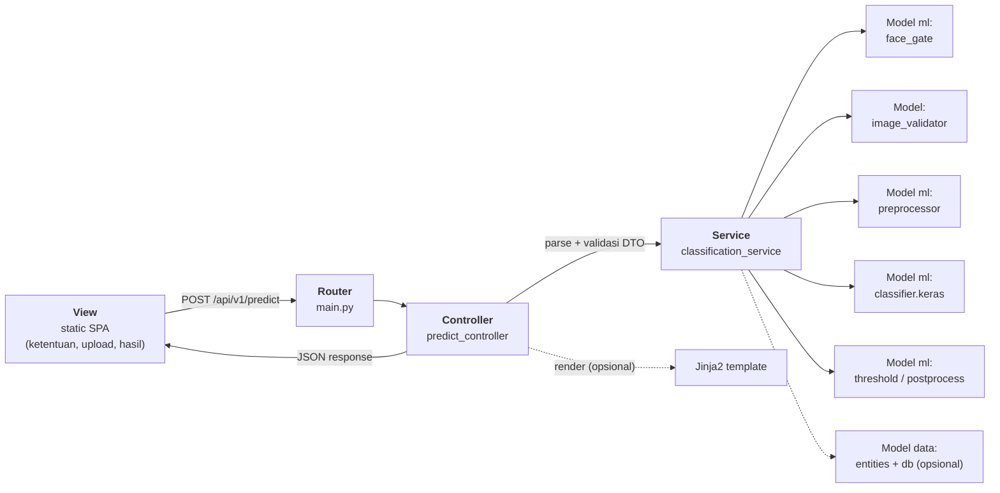
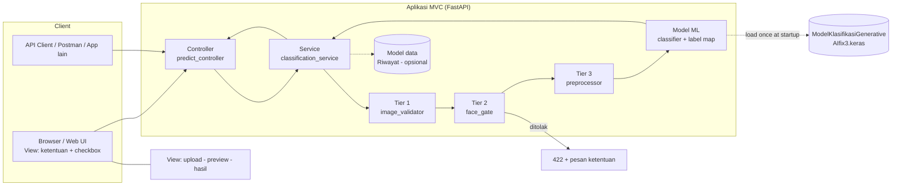
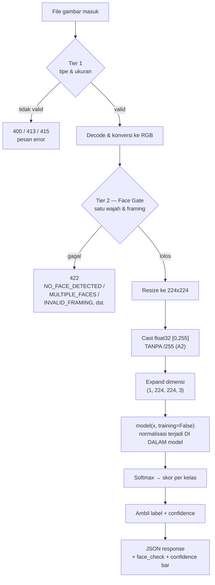
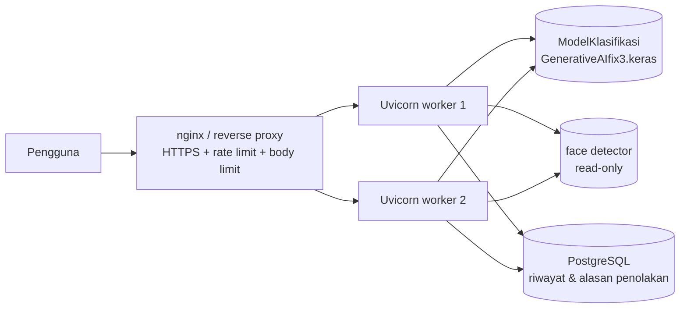

# Arsitektur Sistem Klasifikasi Citra Hasil Generate AI

> **Proyek:** SistemKlasifikasiCitraAI
> **Tanggal:** 06 Oktober 2026
> **Status:** Rev. 8 — **Fase 0 selesai penuh + Fase 1–6 & Fase 8 inti terimplementasi** (MVC + Controller, Face Gate, View, Docker, riwayat SQLite, batch, rate limit — **56 test lolos** di `.venv` 3.11). Sistem **`status: ok`** di `/health`, `ready=true` → 200.
> **Bukti Rev. 8:** `class_indices.json` diturunkan **empiris** (`DALLE|GEMINI|MIDJOURNEY|STABLE_D`, 96,9 %); interpolasi resize dikoreksi `BILINEAR` → `NEAREST` (**81,2 % → 96,9 %**); akurasi model **95,0 %** (80 gambar); end-to-end lewat UI/API **32/32** yang lolos Face Gate; nama label dipercantik di View (`DALL·E`, `Stable Diffusion`).
> Sisa: Fase 7 lanjutan (kalibrasi ambang FAR/FRR, robustness/OOD) & Fase 8 lanjutan (autentikasi/ORM).
> **File model:** `ModelKlasifikasiGenerativeAIfix3.keras` (root proyek, ✅ sudah ada)

---

## 1. Ringkasan (Overview)

Sistem ini adalah aplikasi web berbasis REST API yang mengklasifikasi sebuah gambar ke dalam salah satu dari empat platform AI generator:

| # | Indeks | Kelas | Label di `class_indices.json` | Ditampilkan di UI |
|---|--------|-------|------------------------------|-------------------|
| 1 | 0 | OpenAI DALL·E | `DALLE` | DALL·E |
| 2 | 1 | Google Gemini | `GEMINI` | Gemini |
| 3 | 2 | Midjourney | `MIDJOURNEY` | Midjourney |
| 4 | 3 | Stable Diffusion | `STABLE_D` | Stable Diffusion |

> Urutan indeks di atas **terbukti** (bukan asumsi): 96,9 % akurasi pada 160 gambar
> ketika urutan ini dipakai, vs 25 % bila acak — `scripts/derive_class_indices.py`.
> API selalu membalas label kolom *Label* apa adanya; pemecahan nama yang rapi
> (`DALL·E`, `Stable Diffusion`) dilakukan **hanya di View** (`app.js → prettyLabel`).

> ⚠️ **Batasan domain model:** model hanya dilatih pada citra **wajah manusia — cakupan wajah sampai pundak (head & shoulders)**. Gambar di luar batasan ini (pemandangan, benda, hewan, logo, banyak orang, wajah terpotong) berada di luar distribusi training, sehingga hasil prediksinya **tidak bermakna**. Karena itu sistem **wajib** (a) menampilkan ketentuan ini ke pengguna **sebelum unggah** — §2.2, dan (b) **menolak** gambar yang tidak memenuhi **sebelum inferensi** — Face Gate, §7.2.

Model klasifikasi yang digunakan **sudah ada dan sudah dilatih** sebelumnya: file **`ModelKlasifikasiGenerativeAIfix3.keras`** (Keras 3.13.2, arsitektur EfficientNetB0, lihat §2.3). Tugas sistem adalah:

1. Menampilkan **ketentuan unggahan** kepada pengguna dan meminta persetujuan sebelum unggah (§2.2).
2. Menerima unggahan gambar dari pengguna (web UI atau API client).
3. Memvalidasi file (Tier 1) dan **memvalidasi isi gambar (Tier 2 — Face Gate)**: hanya menerima citra **satu wajah manusia dengan cakupan wajah–pundak**; gambar di luar ketentuan **ditolak, tidak diklasifikasi** (§7.2).
4. Melakukan **preprocessing** sesuai kontrak input model (§7.3 — *bukan* normalisasi ulang).
5. Menjalankan **inferensi** menggunakan file `.keras`.
6. Mengembalikan prediksi beserta skor keyakinan (confidence) dan top-k label.
7. (Opsional) Menyimpan riwayat prediksi **termasuk alasan penolakan** untuk audit/analytics.

Prinsip desain utama:

- **Arsitektur MVC** — **Controller** tipis (hanya HTTP), **Model** memegang ML + data, **View** terpisah sepenuhnya. Lihat §3.1.
- **Model sebagai artefak statis** — file `.keras` tidak dilatih ulang di runtime; sistem hanya melakukan *inference*.
- **Gerbang gagal tertutup (*fail-closed*)** — bila pemeriksaan ketentuan tidak bisa dijalankan (detektor wajah error), request **ditolak**, bukan dilanjutkan tanpa pemeriksaan.
- **Kontrak input model dipatuhi** — normalisasi pixel **hanya** dilakukan seperti saat training; kesalahan di sini menurunkan akurasi **tanpa error apa pun** (§7.3).
- **Stateless API** — endpoint prediksi tidak menyimpan state; skala horizontal mudah.

---

## 2. Batasan Domain, Ketentuan Pengguna & Asumsi

### 2.1 Batasan domain model

Model **hanya valid** untuk citra yang memenuhi semua kriteria berikut:

- **Tepat satu** subjek manusia (satu wajah) per gambar.
- Cakupan **wajah sampai pundak** (*head & shoulders* / *bust portrait*) — bukan seluruh badan, bukan close-up hanya mata/mulut.
- Wajah terlihat jelas: tidak tertutup masker/tangan/rambut menutupi wajah, tidak terpotong tepi frame.
- Pencahayaan cukup dan tidak blur ekstrem.

Gambar di luar kriteria ini = **out-of-distribution** → sistem **menolaknya**, bukan menebak-nebak. Inilah ketentuan yang wajib ditampilkan ke pengguna sebelum unggah (§2.2) dan yang dijalankan server lewat Face Gate (§7.2).

### 2.2 Ketentuan unggahan yang wajib ditampilkan ke pengguna

UI **wajib** menampilkan ketentuan di bawah ini **sebelum** tombol unggah aktif, dan meminta centang persetujuan. Teks berikut adalah *copy* resmi yang bisa langsung dipakai:

> **Ketentuan Unggah Gambar**
>
> Sistem ini mengklasifikasi citra hasil generate AI pada 4 platform (Gemini, DALL·E, Midjourney, Stable Diffusion). Model **hanya dilatih pada citra wajah manusia dengan posisi wajah sampai pundak**, sehingga gambar yang Anda unggah **wajib** memenuhi ketentuan berikut.
>
> **✅ Diperbolehkan**
> - Satu orang saja dalam gambar
> - Wajah terlihat jelas, cakupan wajah sampai pundak (*head & shoulders*)
> - Wajah tidak tertutup masker/tangan/rambut dan tidak terpotong tepi frame
> - Pencahayaan cukup dan gambar tidak blur
>
> **❌ Tidak diperbolehkan**
> - Lebih dari satu orang dalam satu gambar
> - Seluruh badan, atau close-up hanya sebagian wajah (mis. hanya mata)
> - Pemandangan, benda, hewan, logo, teks, meme, atau gambar tanpa wajah
> - Gambar gelap, buram, atau resolusi rendah
>
> **Persyaratan teknis:** format JPG/PNG/WEBP, ukuran ≤ 10 MB, sisi terpendek ≥ 224 px.
>
> ⚠️ Hasil klasifikasi **hanya berlaku** untuk gambar dalam batasan di atas. Gambar di luar batasan akan **ditolak** dan tidak akan diklasifikasi.
>
> ☐ *Saya memahami dan menyetujui ketentuan di atas.*

**Aturan penerapan:**

1. **Checkbox persetujuan** — tombol *upload* tetap `disabled` sampai checkbox dicentang. Ini **UX saja, bukan keamanan**.
2. **Validasi sesungguhnya di server** (Face Gate, §7.2) untuk semua jalur — web maupun API langsung. Jangan pernah menerima flag `skip_face_check` dari client.
3. **Pesan penolakan wajib spesifik** dan menyebut ketentuan mana yang dilanggar (tabel §6.4).
4. Tampilkan ringkasan ketentuan tetap terlihat di halaman hasil (footer/tooltip) agar konteks tidak hilang.
5. Untuk API publik, salin ketentuan yang sama ke `description` endpoint pada dokumentasi OpenAPI, agar integrator ikut meneruskannya ke penggunanya.

**Pesan yang ditampilkan saat ditolak (mapping ke kode error API):**

| Kode error | Pesan untuk pengguna |
|------------|----------------------|
| `NO_FACE_DETECTED` | "Tidak ditemukan wajah manusia pada gambar. Sistem hanya menerima foto potret satu orang dari wajah sampai pundak." |
| `MULTIPLE_FACES` | "Terdeteksi lebih dari satu orang. Unggah foto yang hanya berisi satu orang." |
| `FACE_TOO_SMALL` | "Wajah terlalu kecil dalam gambar. Gunakan potret wajah–pundak, bukan foto seluruh badan atau kerumunan." |
| `FACE_TOO_LARGE` | "Wajah terpotong/terlalu dekat. Posisikan gambar agar wajah dan bahu terlihat seluruhnya." |
| `INVALID_FRAMING` | "Posisi wajah di luar bingkai yang sesuai. Pusatkan wajah dalam bingkai potret." |
| `IMAGE_TOO_LOW_RES` | "Resolusi terlalu rendah. Gunakan gambar dengan sisi terpendek minimal 224 px." |

### 2.3 Asumsi, Temuan Verifikasi & Kondisi Lingkungan

Status diverifikasi langsung dari file `ModelKlasifikasiGenerativeAIfix3.keras` (arsip ZIP berisi `config.json`, `metadata.json`, `model.weights.h5`):

| ID | Status | Temuan | Sumber |
|----|--------|--------|--------|
| A1 | ✅ **Terverifikasi** | Input `(None, 224, 224, 3)`, `dtype=float32` | `config.json` → `InputLayer.batch_shape` |
| A2 | ❌ **Diperbaiki (Rev. 3)** | Normalisasi **sudah ada di dalam model**: `Rescaling(1/255)` → `Normalization(axis=[3])` → `Rescaling([2.090, 2.113, 2.108])`. Karena itu preprocessor **tidak boleh** membagi pixel dengan 255 lagi — kirim `float32` rentang **[0, 255]** | 3 node pertama backbone EfficientNetB0 |
| A3 | ✅ **Terverifikasi (Rev. 7)** | Output `Dense(4, softmax)` ✅ = **4 label** ✅. Urutan label **dibuktikan empiris** (bukan diasumsikan): 24 permutasi × 4 varian interpolasi diuji ke model asli pada 160 gambar → `DALLE, GEMINI, MIDJOURNEY, STABLE_D` **96,9 %** (peluang 25 %). `class_indices.json` kini ada di root | `config.json`; `scripts/derive_class_indices.py` |
| A4 | ⚠️ Perlu konfirmasi | File RGBA/grayscale dikonversi ke RGB | Skrip training |
| A5 | ✅ Konfigurasi sistem | Maks **10 MB**, format JPG/PNG/WEBP, sisi terpendek ≥ 224 px | Keputusan sistem |
| A6 | ⚠️ Perlu konfirmasi | Dataset training = citra **satu wajah**, cakupan wajah–pundak | Skrip training & dataset asli |
| A7 | ⚠️ Perlu konfirmasi | Setiap gambar training berisi **tepat satu** wajah (tidak pernah group photo) | Cek dataset — menentukan apakah `MULTIPLE_FACES` ditolak total atau hanya peringatan |
| A8 | ⚠️ Perlu konfirmasi | Cara crop dataset training menentukan ambang wajah (F5/F6, §7.2) | Bandingkan distribusi rasio wajah di dataset vs ambang |
| A9 | ✅ **Baru** | Keras **3.13.2**, model disimpan `2026-06-10`, bobot ± 46 MB (`model.weights.h5` = 48.683.260 byte) | `metadata.json` |
| A10 | ✅ **Baru** | Arsitektur: `Input → EfficientNetB0 → GlobalAveragePooling2D → Dropout(0.4) → Dense(4, softmax)`; dikompilasi dengan Adam `lr=1e-4`, `categorical_crossentropy`, metrik `accuracy` | `config.json` |
| A11 | ✅ **Baru** | Inferensi wajib mode non-training agar `Dropout(0.4)` **nonaktif**; `load_model(..., compile=False)` cukup (optimizer/metrics tidak dipakai saat prediksi) | `config.json` |

**Implikasi penting dari temuan di atas:**

1. **Normalisasi jangan dobel (A2)** — ini kesalahan paling berbahaya karena tidak menimbulkan error, hanya akurasi anjlok diam-diam. Nilai input harus tetap `[0, 255]` karena model sendiri yang membagi 255.
2. **`class_indices.json` (A3) adalah prasyarat numerik #1** — tanpa file ini, urutan 4 angka output softmax tidak bisa dipetakan ke nama platform (mis. `index 2` = Midjourney atau Gemini?). Jangan menebak.
3. **Versi runtime (A9)** — file dibuat dengan Keras 3.13.2; gunakan `keras==3.13.2` (atau ≥3.13,<4) dan pasang `tensorflow` yang kompatibel.

**Kondisi lingkungan kerja (diperbarui — Fase 0 sebagian besar selesai):**

| Komponen | Kondisi | Aksi |
|----------|---------|------|
| Python | venv **`.venv` (3.11.5)** ✅ + sistem 3.14.7 | TF hanya di 3.11/3.12; 3.14 dipakai untuk test ringan |
| `tensorflow` / `keras` | ✅ 2.21.0 / **3.13.2** (versi metadata file) | Sudah sesuai pin `requirements.txt` |
| `mediapipe`, `opencv-contrib-python` | ✅ 1.0.1 / 5.0.0.93 | ⚠️ mediapipe ≥1.0 **tanpa** API lama `mp.solutions` → pakai Tasks API |
| Model detektor BlazeFace | ✅ `models/blaze_face_short_range.tflite` (±230 KB) | Dibuat oleh `scripts/download_face_model.py` |
| File `.keras` | ✅ ada & **terverifikasi**: input `(1,224,224,3)`, output **4** unit | `scripts/verify_model.py` |
| `class_indices.json` | ✅ **ada** — diturunkan empiris (`scripts/derive_class_indices.py`) | Urutan `DALLE, GEMINI, MIDJOURNEY, STABLE_D` (akurasi 96,9 %) |

> ⚠️ **Catatan penting:** urutan label prediksi ditentukan oleh urutan *class* saat training (`flow_from_directory` → `class_indices`). Jangan pernah mengurutkan label secara alfabetis di kode aplikasi tanpa memastikan sama dengan `class_indices` asli.

---

## 3. Arsitektur High-Level (Pola MVC)

### 3.1 Peta MVC

| Lapisan MVC | Folder | Tanggung jawab | Larangan |
|-------------|--------|----------------|----------|
| **View** | `app/views/` (`templates/` + `static/`) | Tampilan: panel ketentuan, upload, preview, confidence bar, pesan penolakan; memanggil API via `fetch` | Tidak boleh melakukan preprocessing/prediksi; tidak mengevaluasi logika bisnis |
| **Controller** | `app/controllers/` | Menerima request HTTP, validasi input (Pydantic/FormData), memanggil **Service**, menyusun respons (JSON) atau me-render **View** | ❌ Tidak ada logika ML, ❌ tidak ada query SQL, ❌ tidak ada manipulasi piksel |
| **Model (ML)** | `app/models/ml/` | `classifier.py` (memuat file `.keras`), `face_gate.py`, `preprocessor.py`, `labels.py` (petakan `class_indices`) | Tidak tahu apa pun tentang HTTP/JSON |
| **Model (data)** | `app/models/entities/` + `db.py` | Entitas riwayat prediksi/penolakan, akses database | — |
| **Service** *(lapisan use-case)* | `app/services/` | Mengorkestrasi alur: validasi file → Face Gate → preprocess → prediksi → ambang confidence | Bukan bagian MVC murni; dipisah agar **Controller tetap tipis** |
| **DTO / Schema** | `app/schemas/` | Kontrak request/response (Pydantic) yang dipakai Controller & dokumentasi OpenAPI | — |
| **Bootstrap / Router** | `app/main.py` + `config.py` | Lifespan (muat model & detektor), registrasi router Controller, sajikan static/template | — |

**Aturan batas tanggung jawab:**

- Satu handler Controller idealnya **≤ 50 baris**: parse → `service.call()` → susun respons.
- View **hanya** berbicara ke API (`/api/v1/...`), tidak pernah langsung ke Model.
- Satu *use case* = satu method Service (`ClassificationService.classify(file, options)`).
- Inversi dependensi: Controller menerima Service lewat *dependency injection* FastAPI (`Depends`), agar mudah di-*mock* saat testing.

### 3.2 Alur request (MVC)



**Kunci:** panah hanya `Controller → Service → Model`. Controller tidak pernah memanggil `classifier.predict()` atau `face_gate.check()` secara langsung — semuanya lewat Service, supaya logika bisnis teruji tanpa HTTP.

### 3.3 Komponen sistem



### 3.4 Pipeline validasi & inferensi



---

## 4. Tech Stack

| Lapisan | Teknologi | Alasan |
|---------|-----------|--------|
| Bahasa | **Python 3.11 / 3.12** (venv terpisah) | TensorFlow belum mendukung Python 3.14 (kondisi mesin saat ini) |
| Deep Learning | **`keras==3.13.2`** + TensorFlow (backend) | **Sama versi** dengan yang menyimpan file model (A9) |
| Web Framework | **FastAPI** + Uvicorn | Async, DI via `Depends`, dokumentasi OpenAPI gratis |
| Pola arsitektur | **MVC — Controller / Service / Model / View** | Pemisahan tanggung jawab, mudah diuji (§3.1) |
| Template engine | Jinja2 (opsional) | Me-render View bila ingin SSR; kalau SPA murni, `StaticFiles` saja |
| Frontend | HTML/CSS/JS (vanilla atau **React/Vite**) | View: ketentuan → upload → hasil |
| Deteksi wajah | **MediaPipe Face Detection** (default) / OpenCV DNN / RetinaFace | Komponen **Face Gate** — §7.2 |
| Formasi data | Pillow (PIL) / OpenCV | Decode, resize, konversi RGB |
| Database (opsional) | SQLite (dev) / PostgreSQL (prod) | Riwayat prediksi & alasan penolakan |
| Validasi | Pydantic + python-magic | Cek tipe MIME nyata, bukan hanya ekstensi |
| Deployment | **Docker** + Uvicorn/Gunicorn | Reproduksibel, mudah di-deploy |
| Testing | Pytest + httpx (`TestClient`) | Unit (Service/Model) + integration (Controller) |

---

## 5. Struktur Direktori (MVC)

```
SIstemKlasikasiCitraAI/
├── arsitektur.md                          # Dokumen ini (Rev. 4 = sesuai implementasi)
├── ModelKlasifikasiGenerativeAIfix3.keras # ✅ FILE MODEL (± 46 MB, Keras 3.13.2)
├── class_indices.json                     # ✅ A3: DALLE|GEMINI|MIDJOURNEY|STABLE_D (96,9 % empiris)
├── README.md                              # ✅ quickstart Fase 0
├── requirements.txt                       # ✅
├── .env.example                           # ✅ MODEL_PATH, FACE_GATE_*, STRICT_STARTUP
├── .gitignore
├── Dockerfile                             # ✅ python:3.12-slim, STRICT_STARTUP=true
├── docker-compose.yml                     # ✅ 1 worker (hindari model termuat ganda)
├── .venv/                                 # ✅ Python 3.11.5 — dibuat scripts/setup_venv.ps1
├── class_indices.json                     # ✅ DITURUNKAN EMPIRIS: DALLE|GEMINI|MIDJOURNEY|STABLE_D
├── models/blaze_face_short_range.tflite   # ✅ model detektor BlazeFace (±230 KB, Fase 0)
│
├── app/
│   ├── __init__.py
│   ├── main.py                            # ✅ lifespan (label → model → gate → DB), handler error,
│   │                                      #    registrasi router, rate limit, sajikan View
│   ├── config.py                          # ✅ semua konstanta (env-driven, ter-cache)
│   ├── deps.py                            # ✅ dependency injection (Depends) + override saat test
│   ├── errors.py                          # ✅ hierarki AppError → respons JSON seragam
│   ├── middleware.py                      # ✅ RateLimiter (sliding window/IP) + guard 429
│   │
│   ├── controllers/                       # ★ CONTROLLER — lapisan HTTP tipis
│   │   ├── predict_controller.py          # ✅ POST /api/v1/predict, /predict/batch
│   │   ├── health_controller.py           # ✅ /health, /api/v1/model/info, /api/v1/requirements
│   │   └── history_controller.py          # ✅ GET/DELETE /api/v1/history
│   │
│   ├── services/                          # Lapisan use-case
│   │   ├── classification_service.py      # ✅ Tier 1 → Tier 2 → Tier 3 → inferensi → ambang + audit
│   │   ├── image_validator.py             # ✅ Tier 1: ekstensi, MIME/nyata, decode penuh
│   │   ├── history_service.py             # ✅ simpan prediksi & penolakan (fail-soft)
│   │   └── requirements_notice.py         # ✅ copy ketentuan §2.2 (sumber tunggal)
│   │
│   ├── models/                            # ★ MODEL
│   │   ├── db.py                          # ✅ SQLite (stdlib) — tabel predictions
│   │   └── ml/
│   │       ├── classifier.py              # ✅ load .keras (compile=False), predict(training=False)
│   │       ├── face_gate.py               # ✅ aturan F1–F6, MediaPipe/OpenCV, fail-closed
│   │       ├── preprocessor.py            # ✅ [0,255] TANPA /255 (A2) — single source of truth
│   │       ├── postprocessor.py           # ✅ softmax → label + status high/medium/uncertain
│   │       └── labels.py                  # ✅ class_indices.json → label + kamus pesan §2.2
│   │
│   ├── schemas/                           # DTO request/response (Pydantic)
│   │   ├── predict_schema.py              # ✅ PredictResponse, FaceCheckInfo, ModelMeta
│   │   ├── history_schema.py              # ✅ HistoryItem, HistoryPage, HistoryDeleted
│   │   └── error_schema.py                # ✅ ErrorResponse
│   │
│   └── views/                             # ★ VIEW — static SPA (tanpa Jinja2)
│       └── static/
│           ├── index.html                 # ✅ ketentuan + checkbox + upload + hasil
│           ├── css/style.css
│           └── js/app.js                  # ✅ fetch /api/v1/* — tanpa logika ML
│
├── tests/                                 # ✅ 56 test (venv) / 49 + 2 skip (Python 3.14)
│   ├── conftest.py                        # ✅ env test + fake classifier/gate + TestClient
│   ├── fixtures/
│   │   ├── fake_class_indices.json        # label SINTETIS — bukan data training
│   │   └── README.md
│   ├── test_preprocessor.py               # ✅ kontrak [0,255] (A2) + label map
│   ├── test_face_gate.py                  # ✅ F1–F6 + fail-closed
│   ├── test_predict_controller.py         # ✅ sukses, 4xx Tier 1, 422 gate, 503, degraded
│   ├── test_history_and_batch.py          # ✅ riwayat, batch, unit RateLimiter
│   ├── test_model_load_real.py            # ✅ model .keras ASLI — A1/A2/A3 (auto-skip tanpa TF)
│   └── test_mediapipe_detector.py         # ✅ BlazeFace asli: 1 wajah + lolos/gagal FaceGate
│
├── storage/uploads/                       # file sementara (gitignored)
│
└── scripts/
    ├── setup_venv.ps1                     # ✅ Fase 0: buat .venv Python 3.11/3.12 + install
    ├── download_face_model.py             # ✅ Fase 0: unduh model BlazeFace (MediaPipe Tasks)
    ├── derive_class_indices.py            # ✅ A3: buktikan urutan label + interpolasi ke model asli
    ├── evaluate_dataset.py                # ✅ Fase 7: akurasi + confusion matrix (http/direct)
    └── verify_model.py                    # ✅ Fase 0: input/output shape, label,
                                           #    uji 2 varian normalisasi
```

**Belum dibuat:** `models/entities/` + ORM (bila pindah dari SQLite), `db.py` ORM layer,
`scripts/predict_batch.py` (batch CLI), autentikasi API (semuanya Fase 8 lanjutan/opsional).

**Aturan kunci:**

- `app/models/ml/preprocessor.py` adalah *single source of truth* untuk transformasi piksel (kontrak A1+A2).
- `app/models/ml/face_gate.py` adalah *single source of truth* aturan ketentuan §2.1 — pesan error diambil dari satu kamus di `labels.py` agar konsisten dengan copy View.
- Controller **hanya** boleh menyentuh `services/` dan `schemas/`.
- View **hanya** boleh menyentuh endpoint HTTP.

---

## 6. Desain API

Base URL: `/api/v1` · Format: JSON · Semua endpoint (kecuali health) mengembalikan skema error yang konsisten.

### 6.1 Endpoint & Controller pemiliknya

| Method | Path | Controller | Service |
|--------|------|-----------|---------|
| `POST` | `/api/v1/predict` | `predict_controller.classify` | `ClassificationService.classify` |
| `POST` | `/api/v1/predict/batch` | `predict_controller.classify_batch` | `ClassificationService.classify` (loop) |
| `GET`  | `/api/v1/model/info` | `health_controller.model_info` | — |
| `GET`  | `/api/v1/requirements` | `health_controller.requirements` | `RequirementsNotice` |
| `GET`  | `/health` | `health_controller.health` | — |
| `GET`  | `/api/v1/history?page=1` | `history_controller.list_history` | `HistoryService.list` (SQLite) |
| `DELETE`| `/api/v1/history/{id}` | `history_controller.delete_history` | `HistoryService.delete` (SQLite) |
| `GET`  | `/docs` | (otomatis FastAPI) | — |

### 6.2 `POST /api/v1/predict`

**Request:** `multipart/form-data`

| Field | Tipe | Wajib | Keterangan |
|-------|------|-------|------------|
| `file` | binary | ✅ | Gambar JPG/PNG/WEBP, maks 10 MB, **satu wajah, cakupan wajah–pundak** |
| `top_k` | integer | ❌ | Default `4`, maks 4 |
| `agree_terms` | bool | ❌ | Di View selalu `true` (hasil checkbox §2.2). Di API publik boleh dibuat wajib sebagai penanda klien telah menampilkan ketentuan — **tetap bukan pengganti Face Gate** |

> **Tidak ada parameter untuk melewati Face Gate.** Pemeriksaan ketentuan selalu dijalankan di server untuk setiap request.

**Response `200`:**

```json
{
  "success": true,
  "face_check": {
    "status": "passed",
    "faces_detected": 1,
    "face_coverage": 0.38,
    "detector": "mediapipe_face_detection"
  },
  "prediction": {
    "label": "MIDJOURNEY",
    "confidence": 0.9437,
    "status": "high",
    "top_k": [
      { "label": "MIDJOURNEY", "confidence": 0.9437 },
      { "label": "STABLE_D",   "confidence": 0.0312 },
      { "label": "GEMINI",     "confidence": 0.0168 },
      { "label": "DALLE",      "confidence": 0.0083 }
    ]
  },
  "model": {
    "name": "ModelKlasifikasiGenerativeAIfix3",
    "version": "1.0.0",
    "keras_version": "3.13.2",
    "input_shape": [null, 224, 224, 3]
  },
  "processing_time_ms": 127,
  "request_id": "a1b2c3d4-..."
}
```

**Response `4xx/5xx`:**

```json
{
  "success": false,
  "error": {
    "code": "MULTIPLE_FACES",
    "message": "Terdeteksi lebih dari satu wajah. Sistem hanya menerima satu orang per gambar.",
    "requirement_ref": "§2.2 — ❌ Lebih dari satu orang dalam satu gambar"
  },
  "request_id": "a1b2c3d4-..."
}
```

### 6.3 Kode error — Tier 1 (file)

| HTTP | `code` | Penyebab |
|------|--------|----------|
| 400 | `INVALID_IMAGE` | File korup / bukan gambar nyata |
| 400 | `BATCH_TOO_LARGE` | Jumlah file batch melebihi `BATCH_MAX_FILES` |
| 413 | `PAYLOAD_TOO_LARGE` | File > batas ukuran |
| 415 | `UNSUPPORTED_MEDIA_TYPE` | Tipe MIME tidak didukung |
| 422 | `VALIDATION_ERROR` | Field tidak valid (Pydantic) |
| 429 | `RATE_LIMITED` | Melebihi `RATE_LIMIT_PER_MINUTE` per IP (ada header `Retry-After`) |
| 404 | `HISTORY_NOT_FOUND` | ID riwayat tidak ada |
| 500 | `INFERENCE_FAILED` | Error tak terduga saat prediksi |
| 503 | `MODEL_NOT_READY` | Model `.keras` belum selesai dimuat |
| 503 | `LABELS_NOT_READY` | `class_indices.json` belum ada/tidak terbaca |
| 503 | `HISTORY_UNAVAILABLE` | DB riwayat tidak bisa dibuka |

### 6.4 Kode error — Tier 2 (Face Gate / ketentuan pengguna)

| HTTP | `code` | Kondisi | Ketentuan dilanggar |
|------|--------|---------|---------------------|
| 422 | `NO_FACE_DETECTED` | Tidak ada wajah dengan confidence ≥ ambang | ❌ Gambar tanpa wajah |
| 422 | `MULTIPLE_FACES` | Terdeteksi > 1 wajah | ❌ Lebih dari satu orang |
| 422 | `FACE_TOO_SMALL` | `tinggi_wajah / tinggi_gambar` < batas bawah | ❌ Seluruh badan / kerumunan |
| 422 | `FACE_TOO_LARGE` | `tinggi_wajah / tinggi_gambar` > batas atas | ❌ Close-up terpotong |
| 422 | `INVALID_FRAMING` | Pusat wajah di luar pita aman / rasio aspek tak wajar | ✅ Cakupan wajah–pundak |
| 422 | `IMAGE_TOO_LOW_RES` | Sisi terpendek < 224 px | ❌ Resolusi rendah |
| 503 | `FACE_CHECK_UNAVAILABLE` | Detektor wajah gagal dimuat/dijalankan (**fail-closed**) | — |

Setiap error Tier 2 menyertakan `requirement_ref` yang menunjuk butir ketentuan §2.2, sehingga pesan View dapat langsung menautkannya.

### 6.5 `GET /health`

```json
{ "status": "ok", "model_loaded": true, "face_detector_loaded": true, "uptime_s": 3600 }
```

- `GET /health` → selalu **200** (*liveness*: proses hidup/bisa diakses).
- `GET /health?ready=true` → **503** bila `model_loaded` / `face_detector_loaded` /
  `labels_loaded` salah satu false (*readiness* — dipakai `HEALTHCHECK` Docker & orkestrator).

### 6.6 `POST /api/v1/predict/batch` & `GET /api/v1/history`

**Batch** — beberapa file dalam satu request; **satu file ditolak tidak membatalkan lainnya**:

```json
{
  "success": true, "count": 2, "processing_time_ms": 412,
  "results": [
    { "filename": "potret1.png", "success": true,
      "prediction": { "label": "MIDJOURNEY", "confidence": 0.91, "status": "high", "top_k": [] },
      "face_check": { "status": "passed", "faces_detected": 1, "face_coverage": 0.41, "detector": "mediapipe_face_detection" },
      "model": {}, "processing_time_ms": 380, "request_id": "…" },
    { "filename": "pemandangan.png", "success": false,
      "error": { "code": "NO_FACE_DETECTED", "message": "…", "requirement_ref": "§2.2 — ❌ Gambar tanpa wajah" },
      "request_id": "…" }
  ]
}
```

**Riwayat** — menyimpan prediksi sukses **dan** alasan penolakan (audit §2.2):

```json
{ "items": [ { "id": 7, "request_id": "…", "created_at": "2026-10-06T04:31:00+00:00",
               "filename": "potret.png", "label": "MIDJOURNEY", "confidence": 0.91,
               "status": "high", "face_status": "passed", "reject_code": null,
               "processing_ms": 380 } ],
  "page": 1, "size": 20, "total": 1 }
```

- Disimpan ke SQLite (`DATABASE_PATH`, default `storage/history.db`) — tanpa dependensi ORM.
- Bersifat **fail-soft**: bila DB bermasalah, prediksi tetap dijalankan, hanya log warning.
- Gangguan infrastruktur (503 `MODEL_NOT_READY` dsb.) **tidak** dicatat sebagai penolakan —
  hanya error konten (400/413/415/422).
- **Rate limit** `RATE_LIMIT_PER_MINUTE` (default 60, `0` = mati) berlaku untuk semua path
  `/api/`, per IP per path, memakai sliding window 60 detik (lihat `app/middleware.py`).

---

## 7. Alur Inferensi (Detail Teknis)

### 7.1 Startup — Model Loader (Model ML, singleton)

```
lifespan startup (app/main.py)
  ├─ baca config (MODEL_PATH, IMG_SIZE, FACE_GATE_*, AMBANG)
  ├─ verifikasi file ModelKlasifikasiGenerativeAIfix3.keras & class_indices.json ada
  ├─ keras.models.load_model(MODEL_PATH, compile=False)   ← sekali saja (A11)
  ├─ inisialisasi face detector                            ← sekali saja; gagal → startup error
  ├─ warm-up: model(np.zeros((1,224,224,3), np.float32), training=False)
  └─ set flag model_ready = True, face_gate_ready = True
```

- Model dimuat **sekali di startup**, bukan per-request (muat ± 46 MB ≈ detik, prediksi ≈ milidetik).
- `compile=False` (A11): optimizer Adam & loss tidak dipakai saat inferensi → hemat memori & waktu.
- Selalu panggil `model(x, training=False)` agar **Dropout(0.4) nonaktif** dan BatchNorm dalam mode inferensi. `model.predict()` juga benar, tapi `model(x, training=False)` lebih cepat untuk 1 sampel.
- Gunakan `threading.Lock` bila prediksi diparalelkan, karena TF tidak thread-safe pada graph yang sama.

**Mode `STRICT_STARTUP` (diimplementasi di `app/main.py`):**

| Nilai | Perilaku |
|-------|----------|
| `false` (default, pengembangan) | Gagal pemuatan dicatat ke `startup_error`; aplikasi tetap jalan (*degraded*) dan endpoint prediksi membalas **503 + alasan**. `/health` → `status: degraded`. |
| `true` (produksi — di-set di `Dockerfile`) | Aplikasi **langsung berhenti** begitu ada komponen gagal, agar server tidak "hidup" tanpa model/gate. |

### 7.2 Face Gate — validasi ketentuan sebelum inferensi

Karena model hanya dilatih pada potret wajah (§2.1), setiap request **wajib** melewati gerbang ini sebelum preprocessing. Sifatnya **fail-closed**: bila detektor gagal dimuat atau *crash* saat berjalan, request ditolak `503 FACE_CHECK_UNAVAILABLE` — **tidak pernah** dilanjutkan tanpa pemeriksaan.

**Tier 1 — Validasi file (`image_validator.py`):** format MIME nyata (`python-magic`), ukuran ≤ 10 MB, decode Pillow berhasil, `Image.MAX_IMAGE_PIXELS` terpenuhi.

**Tier 2 — Face Gate (`models/ml/face_gate.py`):**

| ID | Pemeriksaan | Kondisi lolos | Gagal → kode |
|----|-------------|---------------|--------------|
| F1 | Resolusi minimal | sisi terpendek ≥ 224 px | `IMAGE_TOO_LOW_RES` |
| F2 | Rasio aspek gambar | 0.5 ≤ W/H ≤ 2.0 | `INVALID_FRAMING` |
| F3 | Ada wajah | ≥ 1 wajah dengan confidence ≥ 0.70 | `NO_FACE_DETECTED` |
| F4 | Jumlah wajah | tepat 1 wajah | `MULTIPLE_FACES` |
| F5 | Cakupan wajah | 0.15 ≤ tinggi_wajah/tinggi_gambar ≤ 0.75 | `FACE_TOO_SMALL` / `FACE_TOO_LARGE` |
| F6 | Posisi wajah | pusat wajah dalam pita aman (x: 0.15–0.85, y: 0.10–0.70) | `INVALID_FRAMING` |

> Nilai ambang F1–F6 adalah **titik awal** dan wajib dikalibrasi pada data validasi (§10.2) — terutama F5/F6, karena bergantung pada cara dataset training di-crop.

**Pilihan detektor wajah:**

| Detektor | Kelebihan | Kekurangan | Rekomendasi |
|----------|-----------|------------|-------------|
| **MediaPipe Face Detection** | Sangat cepat, ringan (BlazeFace ±230 KB) | Kurang akurat pada wajah miring/berat | ✅ Default |
| OpenCV DNN (SSD ResNet-10) | Akurat, mudah di-install | Perlu unduh file `.caffemodel` | Alternatif |
| MTCNN / RetinaFace | Paling akurat | Berat, latensi lebih tinggi | Bila akurasi gate kritis |
| Haar Cascade | Tanpa dependensi berat | Banyak false positive/negative | ❌ Tidak disarankan |

> ⚠️ **Catatan versi (penting):** `mediapipe >= 1.0` **menghapus API lama** `mp.solutions.*`,
> sehingga detektor memakai **Tasks API** (`mediapipe.tasks.python.vision.FaceDetector`) yang
> **wajib punya file model**: `models/blaze_face_short_range.tflite` (±230 KB, sudah ada di repo,
> `.gitignore` memakai `!models/*.tflite`). Bila file itu hilang, jalankan sekali:
> `python scripts/download_face_model.py` — tanpa file tersebut Face Gate gagal-start (**fail-closed**,
> semua prediksi ditolak `FACE_CHECK_UNAVAILABLE`). Konfirmasi bahwa detektor bekerja pada foto
> nyata: `tests/test_mediapipe_detector.py`.

**Kontrak implementasi:**

```python
# app/models/ml/face_gate.py — ilustrasi
@dataclass
class FaceGateResult:
    passed: bool
    code: str | None             # NO_FACE_DETECTED, MULTIPLE_FACES, dst.
    message: str | None          # pesan ramah pengguna (kamus §2.2)
    requirement_ref: str | None  # tautan ke butir ketentuan
    faces_detected: int
    face_coverage: float | None  # tinggi_wajah / tinggi_gambar
    detector: str

def check(raw: bytes, cfg: Config) -> FaceGateResult: ...
```

- Hasil gate **selalu disertakan** pada respons sukses (`face_check`) untuk audit dan debugging.
- Alasan penolakan **dicatat ke log/riwayat** (bukan hanya status HTTP) agar ambang bisa dievaluasi — apakah terlalu ketat atau terlalu longgar.
- **Checkbox persetujuan pengguna (§2.2) bukan pengganti gate** — gate dijalankan di server untuk semua request.

**Batasan yang perlu disadari:** gate memverifikasi *ada wajah, satu wajah, framing benar* — **bukan** apakah gambar benar-benar dihasilkan AI. Foto manusia asli tetap lolos gate; itulah alasan pertanyaan terbuka §14 tetap relevan.

### 7.3 Pipeline Preprocessing (kontrak input model — A1 + A2)

Berdasarkan pembacaan `config.json`, **model sudah menormalisasi sendiri di dalamnya**:

```
input (1,224,224,3) float32 [0,255]
   → Rescaling(1/255)                  # menjadi [0,1]
   → Normalization(axis=[3])           # pengurangan mean bawaan
   → Rescaling([2.090, 2.113, 2.108])  # penskalaan akhir (gaya ImageNet/EfficientNet)
   → blok EfficientNetB0 ...
```

Karena itu preprocessing **di sisi aplikasi** hanya boleh:

```python
# app/models/ml/preprocessor.py — ilustrasi
def preprocess(raw: bytes, cfg: Config) -> np.ndarray:
    img = Image.open(BytesIO(raw)).convert("RGB")            # A4: paksa RGB
    # NEAREST = interpolasi default Keras saat training (lihat catatan di bawah)
    img = img.resize((cfg.IMG_W, cfg.IMG_H), Image.Resampling.NEAREST)  # A1: 224x224
    arr = np.asarray(img, dtype=np.float32)                  # A2: [0,255] — JANGAN /255
    arr = np.expand_dims(arr, axis=0)                        # (1, 224, 224, 3)
    return arr
```

> ⚠️ **Interpolasi resize ikut menentukan akurasi (terbukti, bukan asumsi).**
> `flow_from_directory` memakai interpolasi default Keras = **`nearest`**, sedangkan
> aplikasi awalnya memakai `BILINEAR`. Diuji ke model asli pada 160 gambar dataset
> (`scripts/derive_class_indices.py`):
>
> | Varian | Akurasi |
> |--------|---------|
> | **`nearest` (sesuai training)** | **96,9 %** ← dipakai |
> | `lanczos` | 85,6 % |
> | `bicubic` | 84,4 % |
> | `bilinear` (versi lama aplikasi) | 81,2 % |
>
> Selisih **15,7 poin persentase** hanya karena beda metode resize — contoh nyata
> risiko R1 (*"akurasi turun diam-diam"*). Uji A/B pada 80 gambar lain: model
> asli mencapai **95,0 % top-1** dengan `nearest` (`scripts/evaluate_dataset.py --mode=direct`).

**Checklist konsistensi training ↔ inference:**

- [x] **Rentang nilai masuk `[0, 255]`** — jangan membagi 255 (model sudah melakukannya). *Unit test memeriksa `arr.max() > 1.0`.*
- [x] Ukuran resize **dan metode interpolasi** sama → `NEAREST` (bukti tabel di atas).
- [x] Urutan kanal sama (RGB, bukan BGR — hindari OpenCV default `imread`).
- [x] Urutan label sama dengan `class_indices.json` (A3) → `DALLE | GEMINI | MIDJOURNEY | STABLE_D`, **96,9 %** (vs peluang 25 %).
- [x] Tidak ada augmentasi (flip/rotate) saat inference.
- [x] Varian `/255` dibandingkan di `verify_model.py` — model terbukti mengharapkan `[0,255]` (A2).

### 7.4 Post-processing

```
probs = model(x, training=False)[0]   # softmax → 4 angka
order = np.argsort(probs)[::-1]       # urut menurun
label = LABELS[order[0]]              # LABELS dari class_indices.json
confidence = float(probs[order[0]])
```

### 7.5 Ambang Keyakinan (Threshold)

CNN cenderung *overconfident*. Terapkan ambang minimum:

| Confidence | Status | Respons |
|------------|--------|---------|
| ≥ 0.70 | `high` | Tampilkan label |
| 0.40 – 0.70 | `medium` | Tampilkan label + peringatan "keyakinan rendah" |
| < 0.40 | `uncertain` | Kembalikan `label: "unknown"` + top-k saja |

> Nilai threshold **harus ditentukan dari evaluasi validasi**, bukan tebakan. Lihat §10.

---

## 8. View (Frontend / Web UI)

View berada di `app/views/static/` — **HTML/CSS/JS murni (tanpa Jinja2)** yang disajikan FastAPI lewat `StaticFiles`. View **hanya** memanggil API (`GET /api/v1/requirements`, `POST /api/v1/predict`) dan menampilkan hasil; teks ketentuan diambil dari API agar copy §2.2 tetap berjumlah satu sumber (fallback teks bawaan tetap ada di HTML bila API gagal).

```
┌──────────────────────────────────────────────────┐
│  Klasifikasi Citra AI Generator                  │
├──────────────────────────────────────────────────┤
│  📜 Ketentuan Unggah (wajib dibaca)        [lihat]│
│  ✅ 1 orang • wajah–pundak • wajah jelas          │
│  ❌ multi-orang • seluruh badan • tanpa wajah      │
│  ☑ Saya memahami & menyetujui ketentuan di atas   │
├──────────────────────────────────────────────────┤
│  ┌──────────────┐   Hasil Prediksi               │
│  │              │   ┌──────────────────────────┐ │
│  │  drop zone / │   │ 🏆 midjourney            │ │
│  │  upload area │   │ confidence 94.4%         │ │
│  │  (drag&drop) │   ├──────────────────────────┤ │
│  │              │   │ midjourney     ▓▓▓▓▓▓    │ │
│  └──────────────┘   │ stable_diff   ▓         │ │
│   Preview gambar     │ gemini        ▓         │ │
│   (aktif setelah      │ dalle         ▓         │ │
│    centang ketentuan) └──────────────────────────┘ │
│                        waktu: 127 ms              │
└──────────────────────────────────────────────────┘

Saat ditolak:
┌──────────────────────────────────────────────────┐
│  ⚠️ Gambar tidak dapat diklasifikasi             │
│  Terdeteksi lebih dari satu orang.               │
│  → Lihat ketentuan: ❌ Lebih dari satu orang     │
│  [Unggah gambar lain]                            │
└──────────────────────────────────────────────────┘
```

Fitur View:

1. **Panel ketentuan sebelum unggah** (teks §2.2 — diambil dari `GET /api/v1/requirements`): daftar ✅/❌ + **checkbox persetujuan**; tombol upload aktif hanya setelah dicentang.
2. **Drag & drop** + tombol pilih file; preview lokal via `URL.createObjectURL` sebelum upload (hemat bandwidth).
3. Validasi sisi client (tipe & ukuran) sebagai *fast-fail*, **server tetap wajib menjalankan Tier 1 + Face Gate**.
4. **Confidence bar** per kelas, diurutkan menurun, plus ringkasan `face_check` (mis. "1 wajah terdeteksi — sesuai ketentuan").
5. **Nama label dipercantik di View** — `DALLE` → `DALL·E`, `STABLE_D` → `Stable Diffusion` (`prettyLabel()` di `app.js`). Murni presentasi: respons API tetap memakai kunci `class_indices.json`, sehingga kontrak & urutan label tidak berubah.
6. **State penolakan khusus** — bila Face Gate gagal, tampilkan pesan dari §2.2 yang menunjuk butir ketentuan terkait dan saran perbaikan; **bukan** sekadar "error 422".
7. Indikator status: loading → hasil / ditolak / error.
8. Aksesibel: label `<label for>`, `aria-live` untuk hasil, checkbox dalam `<fieldset><legend>`, kontras memadai.

---

## 9. Keamanan

| Risiko | Mitigasi |
|--------|----------|
| Upload file berbahaya / ekstensi palsu | Cek **MIME nyata** dengan `python-magic`, bukan hanya ekstensi; decode ulang via Pillow |
| Face Gate dilewati dengan panggil API langsung | Validasi **server-side untuk semua jalur**; checkbox hanya UX; tidak ada parameter `skip_face_check` |
| Penolakan layanan (DoS) via file besar / request masif | Batas ukuran di level app **dan** reverse proxy (nginx `client_max_body_size`) |
| Decompression bomb (PNG 50.000×50.000) | `Image.MAX_IMAGE_PIXELS` (default Pillow sudah membatasi), plus hard limit ukuran piksel |
| Path traversal / penyimpanan file | Jangan simpan filename user; gunakan UUID; simpan di `storage/uploads/` yang di-*gitignore* |
| Rate limiting | `slowapi` (token bucket) per IP, mis. 30 request/menit |
| API key (jika publik) | Header `X-API-Key`, divalidasi via dependency FastAPI |
| CORS | Whitelist origin View saja |
| Info leak dari error | Jangan kembalikan stack trace di produksi; log ke server, kirim `request_id` ke client |
| Pesan error membocorkan detail internal detektor | Respons hanya memuat kode + pesan ramah; detail teknis deteksi hanya di log server |
| File `.keras` (bobot model) ter-expose lewat static files | `MODEL_PATH` **di luar** folder static; jangan menyalin file model ke `app/views/static/` |

---

## 10. Strategi Evaluasi & Testing

### 10.1 Kualitas Model

Karena model sudah jadi, sistem tetap memerlukan **evaluasi ulang** sebelum dipakai produksi:

- **Confusion matrix 4×4** — platform mana yang paling sering tertukar (kemungkinan besar `stable_diffusion` ↔ `midjourney`).
- **Per-class Precision / Recall / F1 / Accuracy**.
- **ROC-AUC per kelas** & **calibration curve** (ECE) untuk menentukan threshold §7.5.
- **Uji kontrak preprocessing (A2):** jalankan 4 fixture lewat `verify_model.py` pada dua varian — `[0,255]` (sesuai desain) vs `[0,1]` — dan **validasi ke skrip training/akurasi dataset** mana yang benar sebelum rilis.
- **Uji ketahanan (robustness):** kompresi ulang JPEG (quality 30–70), watermark teks, screenshot, crop, resize kecil lalu di-upscale, gambar hasil kamera. Ini penting karena citra di dunia nyata jarang "bersih".
- **Uji out-of-distribution, dua lapis:**
  1. Gambar **tanpa wajah / multi-wajah / framing salah** → wajib **ditolak Face Gate**, tidak pernah sampai model.
  2. Foto wajah manusia **asli** atau ilustrasi kartun (lolos gate) → hasilnya jangan sampai *confident* keliru; harapannya `uncertain`. Bila sering salah yakin, tambah kelas `real/non-AI` dan latih ulang.

> Dokumentasikan metrik ini di `README.md` atau `MODEL_CARD.md`.

### 10.2 Kalibrasi Face Gate

Ambang F1–F6 (§7.2) dikalibrasi pada **set validasi berlabel** yang berisi dua kumpulan: gambar yang *seharusnya lolos* (potret valid) dan gambar yang *seharusnya ditolak*.

| Metrik | Definisi | Target awal |
|--------|----------|-------------|
| **False-accept rate (FAR)** | Gambar di luar ketentuan yang tetap lolos gate | ≈ 0 untuk non-wajah & multi-wajah |
| **False-reject rate (FRR)** | Potret valid yang salah ditolak | < 5% |

- Iterasi ambang F5/F6 hingga FAR dan FRR memenuhi target; catat nilai akhir di `.env`.
- Audit berkala: telaah 50 entri penolakan terbaru dari log — bila banyak pengguna sah tertolak, longgarkan ambang.
- Setiap perubahan ambang **wajib** diuji ulang `test_face_gate.py`.

### 10.3 Testing (per lapisan MVC)

| Lapisan | Jenis | Cakupan |
|---------|-------|---------|
| Model ML | Unit | `preprocessor` menghasilkan shape `(1,224,224,3)`, `dtype=float32`, **`max > 1.0`** (A2); `labels.py` cocok dengan `class_indices.json` |
| Model ML | Unit | `face_gate`: fixture tanpa wajah, 2 wajah, close-up mata, foto seluruh badan, wajah terpotong, resolusi < 224 px → kode error tepat |
| Service | Unit | `ClassificationService.classify` end-to-end tanpa HTTP (mock detektor untuk kasus fail-closed) |
| Controller | Integration | `TestClient` → `POST /predict` 4 fixture valid → label sesuai + `face_check.status = "passed"` |
| Controller | Fail-closed | Detektor wajah dimatikan → `503 FACE_CHECK_UNAVAILABLE`, **bukan** lanjut inferensi |
| View | Contract | Skema response cocok dengan Pydantic schema; `requirement_ref` menunjuk butir §2.2 yang ada |
| Controller | Negative | File teks, file kosong, JPG rusak, file > batas → error code tepat |
| Aplikasi | Smoke | `GET /health` setelah deploy: `model_loaded` & `face_detector_loaded` = true |
| Aplikasi | Load (opsional) | `locust` — latensi p95 & throughput (Face Gate menambah beberapa ms) |

---

## 11. Deployment

### 11.1 Docker

```dockerfile
# Dockerfile (ilustrasi)
FROM python:3.12-slim
WORKDIR /app
COPY requirements.txt .
RUN pip install --no-cache-dir -r requirements.txt
COPY app/ ./app/
COPY ModelKlasifikasiGenerativeAIfix3.keras ./model/
COPY class_indices.json ./model/
EXPOSE 8000
CMD ["uvicorn", "app.main:app", "--host", "0.0.0.0", "--port", "8000"]
```

### 11.2 Topologi produksi



**Catatan penting:** setiap worker uvicorn memuat salinan model **dan detektor wajah** sendiri → konsumsi RAM = `jumlah_worker × (± 46 MB + detektor)`. Untuk memori terbatas, jalankan **1 worker** atau pisahkan service inferensi sendiri.

- **Health check:** `GET /health` → orchestrator tahu kapan container siap (kedua komponen termuat).
- **Env vars:** `MODEL_PATH=./model/ModelKlasifikasiGenerativeAIfix3.keras`, `CLASS_INDICES_PATH`, `IMG_SIZE=224`, `MAX_UPLOAD_MB`, `FACE_DETECTOR`, `FACE_GATE_MIN_CONF`, `FACE_GATE_MIN_COVERAGE`, `FACE_GATE_MAX_COVERAGE`, `LOG_LEVEL`, `DATABASE_URL`.
- **Monitoring:** log JSON (`request_id`, `label`, `confidence`, `face_gate_status`, `reject_code`, `processing_time_ms`); pantau **rasio penolakan** sebagai indikasi ambang terlalu ketat; opsional Prometheus + Grafana.
- **Versioning:** metadata model (Keras 3.13.2, tanggal simpan) ikut ditampilkan di `GET /model/info`; simpan checkpoint lama agar bisa *rollback*.

### 11.3 Alternatif hosting

| Opsi | Cocok untuk |
|------|-------------|
| VPS + Docker Compose | Deployment sederhana, biaya tetap |
| Railway / Render / Fly.io | Deploy cepat tanpa urus infra |
| Cloud Run (GCP) / AWS ECS | Autoscale berdasarkan request |
| Hugging Face Spaces | Demo/publikasi cepat |

---

## 12. Alur Pengembangan (Roadmap)

| Fase | Deliverable | Status |
|------|-------------|--------|
| **0 — Lingkungan & verifikasi** | venv **Python 3.11/3.12**; `pip install keras==3.13.2 tensorflow mediapipe`; **siapkan `class_indices.json`** (A3); jalankan `scripts/verify_model.py` | ✅ **Selesai** — venv 3.11 ✅, TF/Keras/mediapipe ✅, model detektor ✅, `verify_model.py` ✅ (input `(1,224,224,3)`, output **4** unit), `class_indices.json` ✅ diturunkan **empiris** (96,9 %) |
| **1 — Scaffold MVC** | Struktur §5: `main.py` + `config.py` + `deps.py` + `errors.py`, `controllers/`, `services/`, `models/ml/`, `schemas/`, `views/`; registrasi router; muat komponen di lifespan | ✅ Selesai |
| **2 — Model ML** | `classifier.py`, `preprocessor.py`, `labels.py`, `postprocessor.py` + unit test (shape, dtype, rentang `[0,255]`) | ✅ Selesai |
| **3 — Face Gate** | `face_gate.py`: aturan F1–F6, detektor MediaPipe/OpenCV, kamus pesan §2.2, `test_face_gate.py` | ✅ Selesai (kalibrasi ambang menunggu Fase 7) |
| **4 — Service + Controller** | `ClassificationService`, `predict_controller`, `health_controller`, skema Pydantic, error handling Tier 1 + Tier 2 | ✅ Selesai |
| **5 — View** | `index.html`: panel ketentuan + checkbox persetujuan, drag&drop + preview, confidence bar, state penolakan | ✅ Selesai |
| **6 — Hardening** | Validasi MIME/ukuran, CORS, `X-Request-ID`, log alasan penolakan, **rate limit per IP** (`app/middleware.py`, tanpa dependensi), Dockerfile + compose, `.gitignore` | ✅ Selesai |
| **7 — Evaluasi** | Confusion matrix, kalibrasi threshold model & ambang Face Gate (FAR/FRR), uji robustness & OOD | ⏳ Butuh model berjalan penuh (Fase 0) |
| **8 — (Opsional)** | Riwayat prediksi + penolakan (SQLite `models/db.py`), endpoint batch, rate limit per IP | ✅ **Inti selesai** (riwayat, batch, rate limit) — sisa: autentikasi API, ORM bila pindah DB |

**Kriteria Definition of Done:**

- [x] Model berhasil dimuat di Python 3.11/3.12 dengan `keras==3.13.2` (`compile=False`), `verify_model.py` mencetak input `(None,224,224,3)` dan output 4 unit. — *terverifikasi: `keras 3.13.2 | tensorflow 2.21.0`, output **4** unit*
- [x] `class_indices.json` ada, terbaca `labels.py`, dan urutannya cocok dengan hasil training. — *diturunkan empiris: 24 permutasi × 4 varian interpolasi diuji ke model asli → **96,9 %** (acak 25 %)*
- [x] Akurasi model terukur pada data berlabel. — *`scripts/evaluate_dataset.py`: **95,0 % top-1** (80 gambar); end-to-end lewat API **32/32** yang lolos Face Gate*
- [x] `pytest` hijau: unit Model + unit Service + integration Controller + fail-closed. — **56 test lolos** (venv 3.11); 49 + 2 skip di Python 3.14
- [x] Unit test preprocessing **membuktikan** input `[0, 255]` (bukan `[0, 1]`) — sesuai A2. — *`test_preprocessor.py` + assert di fake classifier*
- [x] Semua 4 kelas dataset **diprediksi benar**. — *`evaluate_dataset.py`: **95,0 % top-1** (80 gambar), confusion matrix hampir diagonal; end-to-end via API **32/32** untuk gambar yang lolos Face Gate*
- [x] Panel ketentuan tampil sebelum upload; tombol upload aktif hanya setelah checkbox dicentang. — *terverifikasi di UI*
- [x] Semua fixture pelanggaran ketentuan **ditolak di server** dengan kode error & `requirement_ref` yang tepat. — *`test_face_gate.py` + `test_predict_controller.py`*
- [x] Face Gate error/tidak tersedia → request ditolak `FACE_CHECK_UNAVAILABLE`. — *tes fail-closed*
- [ ] `docker compose up` berjalan; `GET /health` → `model_loaded: true` dan `face_detector_loaded: true`.
- [ ] Metrik evaluasi, threshold model, dan ambang Face Gate terdokumentasi. — *Fase 7*

---

## 13. Risiko & Mitigasi

| # | Risiko | Dampak | Mitigasi |
|---|--------|--------|----------|
| R1 | **Normalisasi dobel/di luar kontrak (A2)** — input dibagi 255 padahal model sudah membaginya | Akurasi anjlok **diam-diam**, tanpa error | Preprocess hanya di `preprocessor.py`; unit test assert rentang `[0,255]`; uji 2 varian di `verify_model.py` |
| R2 | Urutan label salah / `class_indices.json` tidak ada | Semua prediksi "benar" tapi keliru | Wajib file asli dari training; uji 4 fixture; **Fase 0** |
| R3 | Versi Keras/TF beda → file gagal dimuat | Sistem tidak start | Pin `keras==3.13.2` (A9); uji `load_model` di Fase 0 |
| R4 | Python 3.14 (kondisi mesin) tidak didukung TensorFlow | Instalasi gagal | venv Python 3.11/3.12 |
| R5 | Model overconfident pada data tak dikenal | Foto asli dianggap buatan AI tertentu | Threshold §7.5 + uji OOD; pertimbangkan kelas `real` |
| R6 | Distribusi data inference beda (kompresi, watermark) | Akurasi turun | Uji robustness; augmentasi saat training berikutnya |
| R7 | Latensi tinggi / RAM besar | UX buruk | Model load sekali; `compile=False`; warm-up; batasi worker |
| R8 | Penyalahgunaan API (scraping/DoS) | Biaya & downtime | Rate limit, API key, batas ukuran |
| R9 | Gambar di luar ketentuan lolos ke model | Prediksi menyesatkan | Face Gate fail-closed (§7.2) + ketentuan pengguna (§2.2) |
| R10 | Face Gate terlalu ketat → pengguna sah ditolak | Frustasi, penurunan penggunaan | Kalibrasi FAR/FRR (§10.2); pesan spesifik; audit log penolakan |
| R11 | Gate lolos tapi gambar tetap di luar domain (foto asli, ilustrasi wajah) | Model memaksakan 1 dari 4 label | Threshold `uncertain` (§7.5) + pertimbangkan kelas `non_ai` (§14) |
| R12 | Controller bocor logika bisnis / View menyentuh Model | Kode sulit diuji & dirawat | Aturan §3.1: Controller ≤ 50 baris, hanya panggil Service; review struktur folder |
| R13 | Detektor wajah gagal di runtime | Semua request ditolak | Fail-closed + health check `face_detector_loaded` + alerting |

---

## 14. Keputusan Terbuka (Open Questions)

1. ~~**`class_indices.json` belum ada (PRIORITAS #1)**~~ ✅ **Terjawab (Rev. 7)** — file diturunkan **empiris** dari model + dataset (`scripts/derive_class_indices.py`): urutan `DALLE, GEMINI, MIDJOURNEY, STABLE_D` (96,9 %). Catatan: `flow_from_directory` tanpa argumen `classes=` memang mengurutkan nama folder secara alfabet, **tetapi** nama folder di Google Drive bisa berbeda dari salinan lokal → karena itu urutannya **diukur terhadap model**, bukan diasumsikan.
2. ~~**Konfirmasi preprocessing `[0,255]` vs `[0,1]`**~~ ✅ **Terjawab (Rev. 7)** — skrip training asli ditemukan di `SKRIPSI_ARRAZI\File\gemini-code-*.py`: `ImageDataGenerator(...)` **tanpa parameter `rescale`** → training mengirim `[0,255]`, konsisten dengan A2. Temuan tambahan: interpolasi resize training = **`nearest`** (default `flow_from_directory`), sehingga aplikasi diubah dari `BILINEAR` (81,2 %) ke `NEAREST` (96,9 %).
3. **Format `.keras` vs SavedModel** — file ini Keras 3.13.2; pastikan runtime memakai Keras ≥ 3.13. Jika kelak butuh TFLite/mobile, konversi perlu jalur khusus.
4. **Apa terjadi bila wajah bukan hasil generate AI?** — Face Gate hanya memastikan *ada satu wajah dengan framing benar*, bukan asal-usulnya. Foto orang asli tetap lolos dan akan dipaksa ke salah satu dari 4 label. Disarankan menambah kelas `non_ai/real` dan melatih ulang (§10.1).
5. **Seberapa ketat aturan Face Gate (F1–F6)?** — terutama `MULTIPLE_FACES`: ditolak total atau hanya peringatan? Bergantung pada asumsi A7.
6. **Detektor wajah pilihan** — MediaPipe (cepat) vs RetinaFace (akurat); perlu benchmark latensi vs akurasi.
7. **Apakah `agree_terms` dibuat wajib di API publik?** — penanda integrator sudah menampilkan ketentuan §2.2.
8. **Perlu riwayat & akun pengguna?** — memengaruhi keputusan DB (`models/entities`) & autentikasi.
9. **Volume trafik** — menentukan jumlah worker, kebutuhan GPU, dan pilihan hosting.
10. **View: SSR (Jinja2) atau SPA?** — menentukan apakah `app/views/templates` cukup 1 file atau dipisah proyek frontend.

---

## 15. Referensi

- Keras `.keras` format: <https://keras.io/api/saving/model_apis/keras/>
- EfficientNetB0 (Keras Applications) — preprocessing bawaan di dalam model: <https://keras.io/api/applications/efficientnet/>
- FastAPI — dependency injection & routing: <https://fastapi.tiangolo.com/>
- TensorFlow `tf.keras.models.load_model`: <https://www.tensorflow.org/api_docs/python/tf/keras/models/load_model>
- MediaPipe Face Detection (Tasks API): <https://ai.google.dev/edge/mediapipe/solutions/vision/face_detector/python>
- Model BlazeFace dipakai: <https://storage.googleapis.com/mediapipe-models/face_detector/blaze_face_short_range/float16/1/blaze_face_short_range.tflite>
- OWASP File Upload Cheat Sheet: <https://cheatsheetseries.owasp.org/cheatsheets/File_Upload_Cheat_Sheet.html>
- Pillow ImageOps / MAX_IMAGE_PIXELS: <https://pillow.readthedocs.io/en/stable/handbook/image-file-formats.html>
